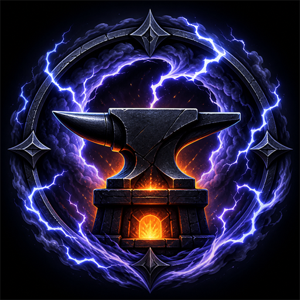

# stormforge-skills

<p align="center">
  
</p>

A personal AI skill repository by Leon Evans.

[Chinese README](./README.zh.md)

## Overview

`stormforge-skills` is a repository for reusable AI Agent skills. The repository currently provides a Responses API image-generation skill that can generate raster images through an OpenAI-compatible `/v1/responses` endpoint using the `image_generation` tool.

## Available Skills

| Skill | Description |
| --- | --- |
| `stormforge-responses-image-gen` | Generate images through an OpenAI-compatible Responses API relay and save the result to disk. |

## Repository Structure

```text
stormforge-skills/
  .codex-plugin/plugin.json
  .claude-plugin/marketplace.json
  scripts/
    validate-skills.mjs
    test-all.mjs
    install-local.ps1
    sync-local-skills.ps1
  skills/
    stormforge-responses-image-gen/
      SKILL.md
      agents/openai.yaml
      scripts/generate.mjs
  stormforge-icon-512.png
```

## Usage

Run the `stormforge-responses-image-gen` script from the repository root:

```powershell
node ".\skills\stormforge-responses-image-gen\scripts\generate.mjs" `
  --prompt "A simple carrot icon on a white background." `
  --image "outputs\carrot.png" `
  --model "gpt-5.6-sol" `
  --use-codex-config
```

The script can also be configured with environment variables or explicit CLI flags. See [`skills/stormforge-responses-image-gen/SKILL.md`](./skills/stormforge-responses-image-gen/SKILL.md) for details.

## Validation

```bash
npm run validate
```

## License

MIT
